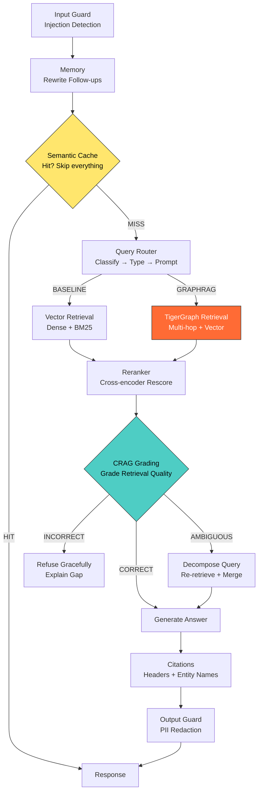
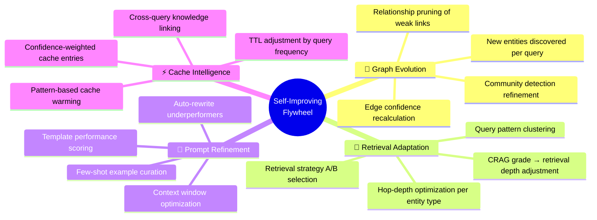
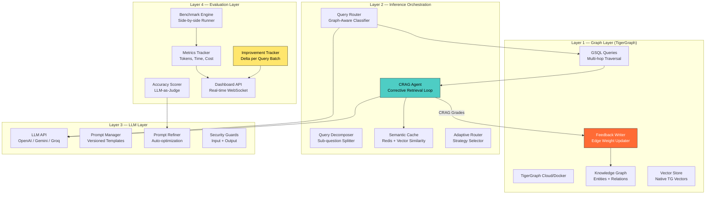
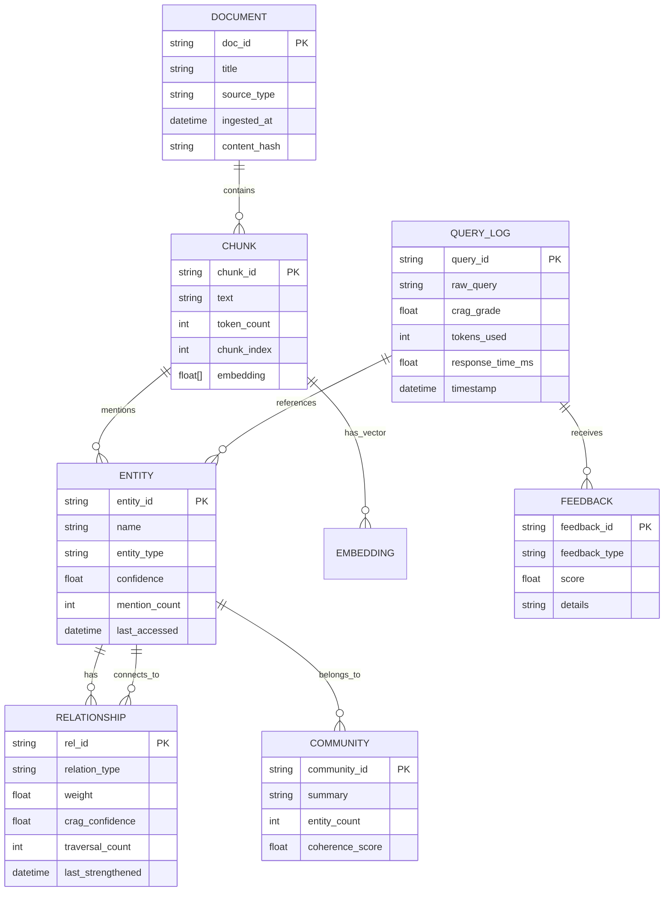
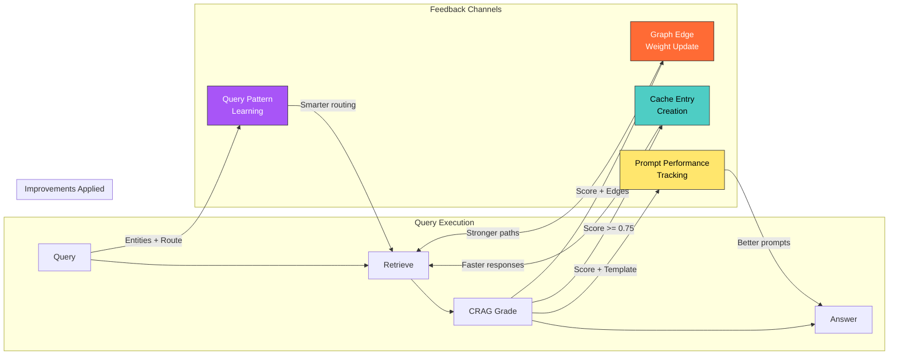

# 🏆 APEX — Self-Improving GraphRAG Inference System
## Product Requirements Document (PRD) v1.0
### TigerGraph GraphRAG Inference Hackathon Submission

---

> [!IMPORTANT]
> **Project Codename:** APEX (Adaptive Performance-Evolving eXecution)
> **Thesis:** A RAG system that doesn't just retrieve — it *learns from every query* to make the next one faster, cheaper, and more accurate. Every interaction strengthens the graph, sharpens the retrieval, and refines the prompts.

---

## Table of Contents

1. [Executive Summary](#1-executive-summary)
2. [Architecture Analysis — Shared Production RAG Template](#2-architecture-analysis)
3. [Self-Improving RAG: The Differentiator](#3-self-improving-rag-the-differentiator)
4. [System Architecture — AI Factory Model](#4-system-architecture--ai-factory-model)
5. [Dual Pipeline Design](#5-dual-pipeline-design)
6. [Layer 1: Graph Layer (TigerGraph)](#6-layer-1-graph-layer-tigergraph)
7. [Layer 2: Inference Orchestration Layer](#7-layer-2-inference-orchestration-layer)
8. [Layer 3: LLM Layer](#8-layer-3-llm-layer)
9. [Layer 4: Evaluation Layer](#9-layer-4-evaluation-layer)
10. [The Self-Improvement Loop (The "Flywheel")](#10-the-self-improvement-loop)
11. [Comparison Dashboard](#11-comparison-dashboard)
12. [Technical Stack & Infrastructure](#12-technical-stack--infrastructure)
13. [API Contracts](#13-api-contracts)
14. [Data Model & Graph Schema](#14-data-model--graph-schema)
15. [Implementation Timeline](#15-implementation-timeline)
16. [Judging Criteria Alignment](#16-judging-criteria-alignment)
17. [Risk Mitigation](#17-risk-mitigation)

---

## 1. Executive Summary

**APEX** is a self-improving GraphRAG inference system that proves — with hard numbers — that graph-augmented LLM inference is faster, cheaper, and more accurate than vanilla LLM calls. But APEX goes further than a static comparison: it implements a **closed-loop feedback flywheel** where every query-response cycle automatically:

- **Strengthens the Knowledge Graph** — new entities, relationships, and confidence scores flow back into TigerGraph
- **Sharpens Retrieval** — CRAG (Corrective RAG) grading adjusts edge weights and retrieval strategies in real-time
- **Warms the Cache** — successful patterns are cached semantically, so similar future queries hit the fast path
- **Refines Prompts** — underperforming prompts are detected and rewritten automatically

The result: **the system gets measurably better with every query**, and the dashboard proves it live.

### Why This Wins

| Criteria | What Others Will Build | What APEX Does |
|---|---|---|
| **Graph Utilization** | Static knowledge graph, fixed queries | Dynamic graph that evolves with usage |
| **Inference Efficiency** | One-shot comparison: GraphRAG vs LLM | Progressive improvement curve visible in real-time |
| **Innovation** | Standard RAG pipeline | Self-correcting CRAG + feedback flywheel |
| **Production Readiness** | Prototype scripts | 4-layer AI Factory architecture, fully decoupled |
| **Dashboard** | Static metrics display | Live, animated dashboard showing improvement over time |

---

## 2. Architecture Analysis

### Analysis of the Shared Production RAG System Template

> [!NOTE]
> The template shared by @shivanivirdi (academy.neosage.io) is an excellent production-grade RAG reference. Below is a 10/10 analysis mapping each component to our hackathon needs.

### 2.1 Repository Structure Assessment

```
production-rag-system/
├── app/                    ← Runtime Application (FastAPI)
│   ├── main.py            # Entry point — CORS, lifespan, middleware
│   ├── config.py          # Env config, model selection, flags
│   ├── models.py          # Pydantic request/response schemas
│   └── Dockerfile
├── routes/                 ← API Layer
│   ├── query.py           # /api/query — SSE streaming
│   ├── search.py          # /api/search — retrieval debugger
│   └── health.py          # Readiness + dependency checks
├── services/               ← Core Business Logic ⭐
│   ├── rag_pipeline.py    # Orchestrates full query flow
│   ├── semantic_cache.py  # Redis MSW vector cache
│   ├── conversation.py    # Sliding window + query rewriting
│   ├── query_router.py    # Intent classify + type prompts
│   ├── document_grader.py # CRAG: relevance scoring ⭐⭐⭐
│   └── query_decomposer.py # CRAG: gap sub-queries
├── retrieval/              ← Search + Ranking
│   ├── hybrid_retriever.py # Dense + BM25 = RRF fusion
│   ├── reranker.py        # Cross-encoder rescoring
│   └── filters.py         # Metadata + entity filtering
├── agents/                 ← Agent Layer ⭐⭐
│   ├── crag.py            # Self-correcting RAG loop
│   ├── adaptive_router.py  # Multi-source routing
│   └── tools/
│       ├── vector_search.py
│       ├── web_search.py   # Live web retrieval
│       └── code_search.py  # Repo search (MCP)
├── prompts/                ← Prompt Management
│   ├── __init__.py        # Registry, hot-swap
│   ├── templates.py       # Versioned, type-specific
│   └── grading.py         # Judge prompts
├── security/               ← Three Guard Layers
│   ├── input_guard.py     # Injection detection (deny-first)
│   ├── content_filter.py  # Retrieved doc validation
│   └── output_guard.py    # PII redaction
└── pipeline/               ← Offline Data Pipeline
    ├── ingest.py           # Format detection + routing
    └── extractors/
        ├── pdf_extractor.py
        ├── html_extractor.py
        ├── docx_extractor.py
        ├── image_extractor.py
        └── text_extractor.py
```

### 2.2 Strengths We'll Adopt

| Component | What It Does Well | How We Adapt for APEX |
|---|---|---|
| **CRAG Agent** (`agents/crag.py`) | Self-correcting RAG loop: grades retrieval → decomposes on failure → retries | We keep CRAG but **feed grades back into TigerGraph edge weights** — bad retrievals weaken connections, good ones strengthen them |
| **Semantic Cache** (`services/semantic_cache.py`) | Redis-based MSW vector cache prevents redundant LLM calls | We add **adaptive cache warming** — when CRAG grades a response as CORRECT, the query-context-answer triple is cached with a confidence score |
| **Query Router** (`services/query_router.py`) | Intent classification → type-specific prompt selection | We enhance with **graph-aware routing** — if TigerGraph has high-confidence paths for the entity, route to graph-first; otherwise, fall back to hybrid |
| **Document Grader** (`services/document_grader.py`) | CRAG relevance scoring for retrieved chunks | The grading signal becomes the **primary feedback mechanism** for graph evolution |
| **Hybrid Retriever** (`retrieval/hybrid_retriever.py`) | Dense + BM25 with RRF fusion | We replace the vector DB component with **TigerGraph's native vector search** for the GraphRAG pipeline, keeping a separate vector store only for the baseline |
| **Security Guards** (`security/`) | Input injection detection, PII redaction | We adopt this directly — essential for production-readiness points with judges |
| **Offline Data Pipeline** (`pipeline/`) | Format detection, chunking, embedding, deduplication | We extend this to also **extract entities and relationships** for TigerGraph ingestion |

### 2.3 Gaps We'll Fill

| Gap in Template | APEX Solution |
|---|---|
| No graph database integration | TigerGraph as the primary knowledge store |
| No feedback loop — CRAG grades are discarded after use | Grades feed back into graph weights + cache confidence |
| No comparison/benchmarking layer | Full Evaluation Layer with side-by-side dashboard |
| No prompt evolution | Automatic prompt refinement based on response quality tracking |
| Static retrieval parameters | Adaptive retrieval depth based on query complexity classification |
| No multi-hop reasoning | TigerGraph GSQL queries for 2-3 hop relationship traversal |

### 2.4 Runtime Query Pipeline — Mapping



> [!TIP]
> The key difference from the template: the **feedback arrows** going backward. Every CRAG grade, response time, and user signal flows back into the Graph Layer and Cache Layer.

---

## 3. Self-Improving RAG: The Differentiator

### 3.1 Yes, You Can Absolutely Build This

The hackathon rules say: "build a working product with two parallel pipelines." Nothing prevents the GraphRAG pipeline from being a *learning* pipeline. In fact, this is exactly what will set you apart from every other team doing a static GraphRAG comparison.

### 3.2 What "Self-Improving" Means Concretely

The system improves along **four axes**, all measurable:



### 3.3 The Self-Improvement Lifecycle

```
Query₁ → [Retrieve] → [Grade: 0.4 AMBIGUOUS] → [Decompose + Retry] → [Grade: 0.85 CORRECT] → Answer₁
              ↓                    ↓                        ↓                      ↓
         Log retrieval        Weaken edges            Strengthen new          Cache triple
         path in graph      that led to 0.4          edges from retry        with score 0.85
              ↓                    ↓                        ↓                      ↓
Query₂ (similar) → [Cache HIT: 0.85 > threshold] → Answer₂ (instant, zero LLM tokens)
```

**Result:** Query₂ costs $0.00, takes <50ms, and is equally accurate. This is the story the dashboard tells.

---

## 4. System Architecture — AI Factory Model

> [!IMPORTANT]
> The hackathon specifically asks for the **AI Factory model** with four separate layers. Our architecture respects this cleanly while adding the self-improvement feedback channels between layers.



---

## 5. Dual Pipeline Design

### 5.1 Pipeline 1 — Baseline (Just LLM)

```
User Question
    → Input Sanitization
    → Full question sent to LLM as-is (or with basic RAG using vector-only retrieval)
    → LLM generates answer
    → Track: tokens_used, response_time_ms, cost_usd
    → Return answer + metrics
```

**Purpose:** The control group. No graph, no multi-hop reasoning, no retrieval optimization. Raw LLM power (expensive, slow).

**Implementation:**
```python
class BaselinePipeline:
    """Pipeline 1: Pure LLM or basic vector-RAG baseline."""

    async def run(self, query: str) -> PipelineResult:
        start = time.perf_counter()
        
        # Option A: Pure LLM (no retrieval)
        # Option B: Basic vector-only RAG (fairer comparison)
        chunks = await self.vector_store.search(query, top_k=10)
        context = "\n".join([c.text for c in chunks])
        
        prompt = self.prompt_manager.get("baseline_qa", 
                                          context=context, 
                                          question=query)
        
        response = await self.llm.generate(prompt)
        
        return PipelineResult(
            answer=response.text,
            tokens_used=response.usage.total_tokens,
            response_time_ms=(time.perf_counter() - start) * 1000,
            cost_usd=self.calculate_cost(response.usage),
            pipeline="baseline",
            metadata={"retrieval_method": "vector_only", "chunks_used": len(chunks)}
        )
```

### 5.2 Pipeline 2 — Self-Improving GraphRAG

```
User Question
    → Input Guard (injection detection)
    → Semantic Cache Check
        → HIT: Return cached answer (0 tokens, <50ms)
        → MISS: Continue
    → Query Router (classify intent, detect entities)
    → TigerGraph Multi-hop Retrieval
        → Entity resolution via graph schema alignment
        → 2-3 hop neighborhood traversal
        → Hybrid: graph-context + vector similarity
    → Reranker (cross-encoder rescore)
    → CRAG Grading
        → CORRECT (>0.7): Generate answer
        → AMBIGUOUS (0.3-0.7): Decompose → sub-queries → re-retrieve → merge
        → INCORRECT (<0.3): Refuse gracefully
    → LLM generates answer with structured graph context
    → Output Guard (PII redaction)
    → FEEDBACK LOOP:
        → Cache the query-context-answer triple
        → Update graph edge weights based on CRAG grade
        → Log metrics for improvement tracking
    → Return answer + metrics
```

**Implementation:**
```python
class SelfImprovingGraphRAGPipeline:
    """Pipeline 2: Graph-augmented RAG with self-improvement feedback."""

    async def run(self, query: str) -> PipelineResult:
        start = time.perf_counter()
        
        # 1. Security
        if not self.input_guard.is_safe(query):
            return PipelineResult.blocked("Input rejected by safety filter")
        
        # 2. Cache check
        cached = await self.semantic_cache.get(query, threshold=0.85)
        if cached:
            return PipelineResult.from_cache(cached, time.perf_counter() - start)
        
        # 3. Query routing + entity extraction
        route = await self.query_router.classify(query)
        entities = await self.entity_extractor.extract(query)
        
        # 4. TigerGraph multi-hop retrieval
        graph_context = await self.tigergraph.multi_hop_retrieve(
            entities=entities,
            hops=route.recommended_hops,  # Adaptive!
            include_vectors=True
        )
        
        # 5. Rerank
        reranked = await self.reranker.score(query, graph_context.chunks)
        
        # 6. CRAG grading
        grade = await self.crag_agent.grade(query, reranked)
        
        if grade.label == "AMBIGUOUS":
            sub_queries = await self.query_decomposer.decompose(query)
            additional_context = []
            for sq in sub_queries:
                sg = await self.tigergraph.multi_hop_retrieve(
                    entities=await self.entity_extractor.extract(sq),
                    hops=2
                )
                additional_context.extend(sg.chunks)
            reranked = await self.reranker.score(query, reranked + additional_context)
            grade = await self.crag_agent.grade(query, reranked)
        
        if grade.label == "INCORRECT":
            return PipelineResult.refused(query, grade.reason)
        
        # 7. Generate with structured context
        prompt = self.prompt_manager.get("graphrag_qa",
            context=self.format_graph_context(reranked),
            relationships=graph_context.relationships,
            question=query
        )
        response = await self.llm.generate(prompt)
        
        # 8. Output guard
        safe_answer = self.output_guard.redact(response.text)
        
        # 9. ⭐ FEEDBACK LOOP — THE SELF-IMPROVEMENT CORE ⭐
        await self.feedback_loop.process(
            query=query,
            context=reranked,
            answer=safe_answer,
            crag_grade=grade,
            entities=entities,
            graph_paths=graph_context.traversal_paths,
            response_time=time.perf_counter() - start,
            tokens_used=response.usage.total_tokens
        )
        
        return PipelineResult(
            answer=safe_answer,
            tokens_used=response.usage.total_tokens,
            response_time_ms=(time.perf_counter() - start) * 1000,
            cost_usd=self.calculate_cost(response.usage),
            pipeline="graphrag_self_improving",
            crag_grade=grade.score,
            cache_entry_created=True,
            graph_updates_applied=True,
            metadata={
                "retrieval_method": "graph_multi_hop + vector_hybrid",
                "hops_used": route.recommended_hops,
                "entities_resolved": len(entities),
                "relationships_traversed": len(graph_context.relationships),
                "crag_grade": grade.score,
                "improvement_delta": await self.improvement_tracker.get_delta()
            }
        )
```

---

## 6. Layer 1: Graph Layer (TigerGraph)

### 6.1 Graph Schema



### 6.2 GSQL Queries for Multi-Hop Retrieval

```gsql
// Query 1: Entity-Centric Multi-Hop Retrieval
CREATE QUERY multi_hop_retrieve(
    SET<STRING> seed_entities, 
    INT max_hops = 2,
    INT top_k = 20,
    FLOAT min_edge_weight = 0.3
) FOR GRAPH MyGraph {
    
    SetAccum<EDGE> @@traversed_edges;
    SetAccum<VERTEX> @@visited_entities;
    HeapAccum<VERTEX>(top_k, crag_confidence DESC) @@top_chunks;
    
    // Seed: find initial entities
    Seeds = {Entity.*};
    Matched = SELECT s FROM Seeds:s
              WHERE s.name IN seed_entities;
    
    // Multi-hop traversal with confidence filtering
    Current = Matched;
    FOREACH i IN RANGE[1, max_hops] DO
        Next = SELECT t FROM Current:s -(Relationship:e)- Entity:t
               WHERE e.weight >= min_edge_weight
               ACCUM @@traversed_edges += e,
                     @@visited_entities += t,
                     // Increment traversal count (usage tracking)
                     e.traversal_count += 1;
        Current = Next;
    END;
    
    // Collect chunks from visited entities
    Chunks = SELECT c FROM @@visited_entities:e -(mentions>:m)- Chunk:c
             ACCUM @@top_chunks += c;
    
    PRINT @@top_chunks;
    PRINT @@traversed_edges;
}

// Query 2: Feedback-Driven Edge Weight Update
CREATE QUERY update_edge_weights(
    STRING query_id,
    SET<STRING> traversed_edge_ids,
    FLOAT crag_grade  // 0.0 to 1.0
) FOR GRAPH MyGraph {
    
    // Exponential moving average for edge confidence
    FLOAT alpha = 0.3;  // Learning rate
    
    Edges = {Relationship.*};
    Updated = SELECT e FROM Edges:e
              WHERE e.rel_id IN traversed_edge_ids
              ACCUM 
                  e.crag_confidence = (1 - alpha) * e.crag_confidence + alpha * crag_grade,
                  e.weight = e.weight * (0.8 + 0.4 * crag_grade),  // Scale: 0.8x to 1.2x
                  e.last_strengthened = now();
    
    PRINT Updated.size() AS edges_updated;
}

// Query 3: Entity Confidence Decay (run periodically)
CREATE QUERY decay_unused_entities(
    INT days_threshold = 7,
    FLOAT decay_factor = 0.95
) FOR GRAPH MyGraph {
    
    Stale = SELECT e FROM Entity:e
            WHERE datetime_diff(now(), e.last_accessed) > days_threshold * 86400
            ACCUM e.confidence = e.confidence * decay_factor;
    
    PRINT Stale.size() AS decayed_count;
}
```

### 6.3 TigerGraph Integration via pyTigerGraph

```python
import pyTigerGraph as tg

class TigerGraphLayer:
    """Layer 1: All graph operations go through this class."""
    
    def __init__(self, config: TigerGraphConfig):
        self.conn = tg.TigerGraphConnection(
            host=config.host,
            graphname=config.graph_name,
            username=config.username,
            password=config.password,
            apiToken=config.api_token
        )
    
    async def multi_hop_retrieve(
        self, 
        entities: list[Entity], 
        hops: int = 2,
        include_vectors: bool = True
    ) -> GraphContext:
        """Execute multi-hop retrieval from seed entities."""
        
        result = self.conn.runInstalledQuery(
            "multi_hop_retrieve",
            params={
                "seed_entities": [e.name for e in entities],
                "max_hops": hops,
                "top_k": 20,
                "min_edge_weight": 0.3
            }
        )
        
        chunks = [Chunk.from_tg(c) for c in result[0]["@@top_chunks"]]
        edges = [Edge.from_tg(e) for e in result[1]["@@traversed_edges"]]
        
        if include_vectors:
            # Hybrid: also do vector similarity search
            vector_results = self.conn.runInstalledQuery(
                "vector_search",
                params={"query_embedding": entities[0].embedding, "top_k": 10}
            )
            chunks = self.merge_and_deduplicate(chunks, vector_results)
        
        return GraphContext(chunks=chunks, relationships=edges, traversal_paths=...)
    
    async def apply_feedback(
        self, 
        query_id: str,
        traversed_edges: list[str],
        crag_grade: float
    ):
        """Feed CRAG grades back into graph edge weights."""
        
        self.conn.runInstalledQuery(
            "update_edge_weights",
            params={
                "query_id": query_id,
                "traversed_edge_ids": traversed_edges,
                "crag_grade": crag_grade
            }
        )
```

---

## 7. Layer 2: Inference Orchestration Layer

### 7.1 Query Router — Graph-Aware Classification

```python
class GraphAwareQueryRouter:
    """
    Decides HOW to handle a query based on:
    1. Intent classification (factual / analytical / creative / comparison)
    2. Entity graph coverage (do we have these entities in TigerGraph?)
    3. Historical query pattern matching
    """
    
    STRATEGIES = {
        "graph_first": {
            "description": "Entities exist in graph with high confidence",
            "retrieval": "multi_hop + vector",
            "hops": 2,
            "expected_token_savings": "40-70%"
        },
        "hybrid_balanced": {
            "description": "Partial graph coverage, supplement with vector search",
            "retrieval": "graph_1hop + dense_vector + bm25",
            "hops": 1,
            "expected_token_savings": "20-40%"
        },
        "vector_fallback": {
            "description": "No graph coverage, fall back to vector-only",
            "retrieval": "dense_vector + bm25",
            "hops": 0,
            "expected_token_savings": "10-20%"
        }
    }
    
    async def classify(self, query: str) -> RouteDecision:
        # 1. Extract candidate entities
        entities = await self.entity_extractor.extract(query)
        
        # 2. Check graph coverage
        coverage = await self.tigergraph.check_entity_coverage(entities)
        
        # 3. Check query pattern cache
        similar_past = await self.pattern_cache.find_similar(query, threshold=0.8)
        
        # 4. Select strategy
        if coverage.ratio > 0.7 and coverage.avg_confidence > 0.5:
            strategy = "graph_first"
            hops = self.adaptive_hop_selector(entities, coverage)
        elif coverage.ratio > 0.3:
            strategy = "hybrid_balanced"
            hops = 1
        else:
            strategy = "vector_fallback"
            hops = 0
        
        # 5. If we've seen similar queries improve with different strategies, adapt
        if similar_past and similar_past.better_strategy:
            strategy = similar_past.better_strategy
            hops = similar_past.optimal_hops
        
        return RouteDecision(
            strategy=strategy,
            recommended_hops=hops,
            entities=entities,
            coverage=coverage
        )
```

### 7.2 CRAG Agent — Corrective Retrieval with Feedback

```python
class CRAGAgent:
    """
    Corrective Retrieval Augmented Generation.
    Grades retrieval quality and triggers correction when needed.
    
    The KEY innovation: grades are not discarded — they feed back into
    the Graph Layer to strengthen/weaken edges.
    """
    
    GRADE_THRESHOLDS = {
        "CORRECT": 0.7,      # High confidence — generate directly
        "AMBIGUOUS": 0.3,     # Medium — decompose and retry
        "INCORRECT": 0.0      # Low — refuse gracefully
    }
    
    async def grade(self, query: str, retrieved_chunks: list[Chunk]) -> CRAGGrade:
        """Use LLM-as-Judge to grade retrieval quality."""
        
        prompt = self.prompt_manager.get("crag_grading",
            query=query,
            chunks="\n---\n".join([c.text for c in retrieved_chunks[:5]])
        )
        
        response = await self.llm.generate(prompt, temperature=0.0)
        
        score = self.parse_grade(response.text)
        
        if score >= self.GRADE_THRESHOLDS["CORRECT"]:
            label = "CORRECT"
        elif score >= self.GRADE_THRESHOLDS["AMBIGUOUS"]:
            label = "AMBIGUOUS"
        else:
            label = "INCORRECT"
        
        return CRAGGrade(
            score=score,
            label=label,
            reason=response.text,
            graded_at=datetime.utcnow()
        )
    
    async def decompose_and_retry(
        self, 
        query: str, 
        original_context: list[Chunk]
    ) -> tuple[list[Chunk], CRAGGrade]:
        """Break query into sub-questions, retrieve for each, merge results."""
        
        sub_queries = await self.query_decomposer.decompose(query)
        all_chunks = list(original_context)
        
        for sq in sub_queries:
            entities = await self.entity_extractor.extract(sq)
            new_context = await self.tigergraph.multi_hop_retrieve(entities, hops=2)
            all_chunks.extend(new_context.chunks)
        
        # Deduplicate and rerank
        deduped = self.deduplicate(all_chunks)
        reranked = await self.reranker.score(query, deduped)
        
        # Re-grade
        new_grade = await self.grade(query, reranked)
        
        return reranked, new_grade
```

### 7.3 Semantic Cache — Confidence-Weighted

```python
class AdaptiveSemanticCache:
    """
    Redis-backed semantic cache with confidence weighting.
    Cache entries are scored by CRAG grade — only high-quality
    responses are served from cache.
    """
    
    def __init__(self, redis_client, embedding_model):
        self.redis = redis_client
        self.embedder = embedding_model
        self.min_confidence = 0.75  # Only cache entries with CRAG grade >= this
    
    async def get(self, query: str, threshold: float = 0.85) -> CacheEntry | None:
        """Check cache with semantic similarity + confidence filtering."""
        
        query_embedding = await self.embedder.embed(query)
        
        # Redis vector similarity search
        results = self.redis.ft.search(
            Query(f"*=>[KNN 3 @embedding $vec AS score]")
            .sort_by("score")
            .dialect(2),
            query_params={"vec": query_embedding.tobytes()}
        )
        
        for result in results.docs:
            if float(result.score) >= threshold and float(result.confidence) >= self.min_confidence:
                # Increment hit count for analytics
                self.redis.hincrby(f"cache:{result.id}", "hit_count", 1)
                return CacheEntry.from_redis(result)
        
        return None
    
    async def put(
        self, 
        query: str, 
        context: list[Chunk], 
        answer: str, 
        crag_grade: float
    ):
        """Only cache if CRAG grade exceeds minimum confidence."""
        
        if crag_grade < self.min_confidence:
            return  # Don't pollute cache with mediocre answers
        
        embedding = await self.embedder.embed(query)
        
        entry = {
            "query": query,
            "answer": answer,
            "confidence": crag_grade,
            "embedding": embedding.tobytes(),
            "created_at": datetime.utcnow().isoformat(),
            "hit_count": 0,
            "ttl_seconds": self.calculate_ttl(crag_grade)  # Higher grade = longer TTL
        }
        
        self.redis.hset(f"cache:{uuid4()}", mapping=entry)
```

---

## 8. Layer 3: LLM Layer

### 8.1 Prompt Manager with Auto-Refinement

```python
class PromptManager:
    """
    Versioned prompt templates with performance tracking.
    Underperforming prompts are automatically flagged for refinement.
    """
    
    TEMPLATES = {
        "graphrag_qa": {
            "v1": {
                "template": """You are an expert assistant. Use ONLY the provided context to answer.

**Graph Context (Structured Relationships):**
{relationships}

**Retrieved Passages:**
{context}

**Question:** {question}

Instructions:
- Cite specific entities and relationships from the graph context
- If the context is insufficient, say so clearly
- Be concise but complete

**Answer:**""",
                "avg_crag_score": 0.0,
                "uses": 0,
                "active": True
            }
        },
        
        "crag_grading": {
            "v1": {
                "template": """Grade the relevance of these retrieved passages to the question.

Question: {query}

Retrieved Passages:
{chunks}

Score from 0.0 to 1.0:
- 1.0 = perfectly relevant, contains the complete answer
- 0.7 = mostly relevant, answer can be derived
- 0.4 = partially relevant, some useful info
- 0.1 = barely relevant, mostly noise
- 0.0 = completely irrelevant

Output ONLY a JSON: {{"score": <float>, "reason": "<brief explanation>"}}""",
                "avg_crag_score": 0.0,
                "uses": 0,
                "active": True
            }
        },
        
        "baseline_qa": {
            "v1": {
                "template": """Answer the following question using the provided context.

Context:
{context}

Question: {question}

Answer:""",
                "avg_crag_score": 0.0,
                "uses": 0,
                "active": True
            }
        }
    }
    
    async def track_and_refine(self, template_name: str, version: str, crag_score: float):
        """Track prompt performance and trigger refinement if needed."""
        
        template = self.TEMPLATES[template_name][version]
        template["uses"] += 1
        template["avg_crag_score"] = (
            (template["avg_crag_score"] * (template["uses"] - 1) + crag_score) 
            / template["uses"]
        )
        
        # If average score drops below threshold after sufficient samples
        if template["uses"] >= 20 and template["avg_crag_score"] < 0.6:
            await self.auto_refine(template_name, version)
    
    async def auto_refine(self, template_name: str, version: str):
        """Use LLM to generate an improved version of an underperforming prompt."""
        
        old_template = self.TEMPLATES[template_name][version]["template"]
        avg_score = self.TEMPLATES[template_name][version]["avg_crag_score"]
        
        refinement_prompt = f"""This prompt template has an average quality score of {avg_score:.2f}/1.0 
(target: 0.7+). Improve it to produce better, more focused responses.

Current template:
{old_template}

Generate an improved version that:
1. Provides clearer instructions
2. Better structures the context usage
3. Reduces hallucination
4. Encourages more precise answers

Return ONLY the improved template, preserving all {{variable}} placeholders."""

        improved = await self.llm.generate(refinement_prompt)
        
        new_version = f"v{int(version[1:]) + 1}"
        self.TEMPLATES[template_name][new_version] = {
            "template": improved.text,
            "avg_crag_score": 0.0,
            "uses": 0,
            "active": True,
            "parent_version": version,
            "refinement_reason": f"avg_score={avg_score:.2f}"
        }
        
        # Deactivate old version
        self.TEMPLATES[template_name][version]["active"] = False
```

### 8.2 LLM Abstraction Layer

```python
class LLMLayer:
    """
    Unified LLM interface supporting multiple providers.
    Tracks token usage and cost per call for benchmarking.
    """
    
    PRICING = {
        "gpt-4o-mini": {"input": 0.15/1_000_000, "output": 0.60/1_000_000},
        "gpt-4o": {"input": 2.50/1_000_000, "output": 10.00/1_000_000},
        "gemini-2.0-flash": {"input": 0.10/1_000_000, "output": 0.40/1_000_000},
        "groq-llama-3.3-70b": {"input": 0.59/1_000_000, "output": 0.79/1_000_000},
    }
    
    async def generate(self, prompt: str, **kwargs) -> LLMResponse:
        response = await self.client.chat.completions.create(
            model=self.model,
            messages=[{"role": "user", "content": prompt}],
            **kwargs
        )
        
        usage = response.usage
        cost = (
            usage.prompt_tokens * self.PRICING[self.model]["input"] +
            usage.completion_tokens * self.PRICING[self.model]["output"]
        )
        
        return LLMResponse(
            text=response.choices[0].message.content,
            usage=TokenUsage(
                prompt_tokens=usage.prompt_tokens,
                completion_tokens=usage.completion_tokens,
                total_tokens=usage.total_tokens
            ),
            cost_usd=cost,
            model=self.model,
            latency_ms=response.response_ms
        )
```

---

## 9. Layer 4: Evaluation Layer

### 9.1 Benchmark Engine — Side-by-Side Runner

```python
class BenchmarkEngine:
    """
    Runs both pipelines on the same query simultaneously,
    collects metrics, and feeds the comparison dashboard.
    """
    
    def __init__(self, baseline: BaselinePipeline, graphrag: SelfImprovingGraphRAGPipeline):
        self.baseline = baseline
        self.graphrag = graphrag
        self.metrics_store = MetricsStore()  # SQLite or PostgreSQL
    
    async def run_comparison(self, query: str) -> ComparisonResult:
        """Run both pipelines concurrently on the same query."""
        
        # Run in parallel
        baseline_task = asyncio.create_task(self.baseline.run(query))
        graphrag_task = asyncio.create_task(self.graphrag.run(query))
        
        baseline_result, graphrag_result = await asyncio.gather(
            baseline_task, graphrag_task
        )
        
        # Score accuracy using LLM-as-Judge
        accuracy = await self.accuracy_scorer.compare(
            query=query,
            answer_a=baseline_result.answer,
            answer_b=graphrag_result.answer
        )
        
        # Calculate deltas
        comparison = ComparisonResult(
            query=query,
            baseline=baseline_result,
            graphrag=graphrag_result,
            token_savings_pct=self.calc_savings(
                baseline_result.tokens_used, graphrag_result.tokens_used
            ),
            speed_improvement_pct=self.calc_improvement(
                baseline_result.response_time_ms, graphrag_result.response_time_ms
            ),
            cost_savings_pct=self.calc_savings(
                baseline_result.cost_usd, graphrag_result.cost_usd
            ),
            accuracy_scores=accuracy,
            timestamp=datetime.utcnow()
        )
        
        # Persist for dashboard
        await self.metrics_store.save(comparison)
        
        # Broadcast to dashboard via WebSocket
        await self.dashboard_ws.broadcast(comparison.to_json())
        
        return comparison
```

### 9.2 Metrics Tracked

| Metric | Description | Source |
|---|---|---|
| `tokens_used` | Total tokens (prompt + completion) per query | LLM API response |
| `response_time_ms` | End-to-end latency from query to answer | `time.perf_counter()` |
| `cost_usd` | Dollar cost per query based on model pricing | Calculated from token usage |
| `crag_grade` | Retrieval quality score (0.0–1.0) | CRAG Agent |
| `accuracy_score` | LLM-as-Judge comparative accuracy | Evaluation prompt |
| `cache_hit_rate` | % of queries served from cache | Semantic Cache |
| `graph_coverage` | % of query entities found in graph | TigerGraph |
| `improvement_delta` | How much better this batch vs. previous | Improvement Tracker |
| `edge_updates` | Number of graph edge weights modified | Feedback Loop |
| `prompt_version` | Which prompt template version was used | Prompt Manager |

### 9.3 LLM-as-Judge Accuracy Scoring

```python
class AccuracyScorer:
    """Use a separate LLM call to judge answer quality."""
    
    JUDGE_PROMPT = """You are an impartial judge evaluating two answers to the same question.

Question: {query}

Answer A (Baseline):
{answer_a}

Answer B (GraphRAG):
{answer_b}

Rate each answer on:
1. **Factual Accuracy** (0-10): Are the facts correct?
2. **Completeness** (0-10): Does it fully answer the question?
3. **Relevance** (0-10): Does it stay on topic?
4. **Conciseness** (0-10): Is it appropriately brief?

Output JSON:
{{
    "answer_a": {{"accuracy": <int>, "completeness": <int>, "relevance": <int>, "conciseness": <int>, "total": <int>}},
    "answer_b": {{"accuracy": <int>, "completeness": <int>, "relevance": <int>, "conciseness": <int>, "total": <int>}},
    "winner": "A" | "B" | "tie",
    "explanation": "<brief reasoning>"
}}"""
```

### 9.4 Improvement Tracker — Proving the "Self-Improving" Claim

```python
class ImprovementTracker:
    """
    Tracks performance metrics over time to prove the system improves.
    Groups queries into batches and computes rolling averages.
    """
    
    async def get_improvement_curve(self) -> ImprovementCurve:
        """Calculate how much the system has improved over query batches."""
        
        batches = await self.metrics_store.get_batches(batch_size=10)
        
        curve = []
        for i, batch in enumerate(batches):
            avg_metrics = {
                "batch_number": i + 1,
                "avg_tokens": np.mean([q.graphrag.tokens_used for q in batch]),
                "avg_response_time_ms": np.mean([q.graphrag.response_time_ms for q in batch]),
                "avg_cost_usd": np.mean([q.graphrag.cost_usd for q in batch]),
                "avg_crag_grade": np.mean([q.graphrag.crag_grade for q in batch]),
                "cache_hit_rate": sum(1 for q in batch if q.graphrag.from_cache) / len(batch),
                "avg_accuracy": np.mean([q.accuracy_scores.answer_b.total for q in batch]),
            }
            
            if i > 0:
                prev = curve[-1]
                avg_metrics["token_delta_pct"] = (
                    (prev["avg_tokens"] - avg_metrics["avg_tokens"]) / prev["avg_tokens"] * 100
                )
                avg_metrics["speed_delta_pct"] = (
                    (prev["avg_response_time_ms"] - avg_metrics["avg_response_time_ms"]) 
                    / prev["avg_response_time_ms"] * 100
                )
                avg_metrics["accuracy_delta"] = (
                    avg_metrics["avg_accuracy"] - prev["avg_accuracy"]
                )
            
            curve.append(avg_metrics)
        
        return ImprovementCurve(batches=curve)
```

---

## 10. The Self-Improvement Loop

> [!CAUTION]
> This is the **core differentiator** of APEX. Every other team will have a static GraphRAG comparison. APEX shows its GraphRAG pipeline getting *better* over time.

### 10.1 Feedback Loop Architecture



### 10.2 Feedback Processor Implementation

```python
class FeedbackLoop:
    """
    The heart of self-improvement.
    Processes every query result and updates the system accordingly.
    """
    
    async def process(
        self,
        query: str,
        context: list[Chunk],
        answer: str,
        crag_grade: CRAGGrade,
        entities: list[Entity],
        graph_paths: list[GraphPath],
        response_time: float,
        tokens_used: int
    ):
        """Process feedback from a single query execution."""
        
        # Channel 1: Graph Edge Weight Update
        if graph_paths:
            edge_ids = [e.id for path in graph_paths for e in path.edges]
            await self.tigergraph.apply_feedback(
                query_id=str(uuid4()),
                traversed_edges=edge_ids,
                crag_grade=crag_grade.score
            )
        
        # Channel 2: Semantic Cache (only high-quality responses)
        if crag_grade.score >= 0.75:
            await self.semantic_cache.put(
                query=query,
                context=context,
                answer=answer,
                crag_grade=crag_grade.score
            )
        
        # Channel 3: Prompt Performance Tracking
        await self.prompt_manager.track_and_refine(
            template_name="graphrag_qa",
            version=self.prompt_manager.active_version("graphrag_qa"),
            crag_score=crag_grade.score
        )
        
        # Channel 4: Query Pattern Learning
        await self.pattern_learner.record(
            query=query,
            entities=entities,
            strategy_used=self.last_route.strategy,
            crag_grade=crag_grade.score,
            response_time=response_time
        )
        
        # Channel 5: Entity Discovery (extract new entities from answer)
        if crag_grade.score >= 0.7:
            new_entities = await self.entity_extractor.extract(answer)
            existing = set(e.name for e in entities)
            discovered = [e for e in new_entities if e.name not in existing]
            
            if discovered:
                await self.tigergraph.upsert_entities(discovered)
                await self.tigergraph.create_relationships(
                    source_entities=entities,
                    discovered_entities=discovered,
                    relation_type="DISCOVERED_VIA_QUERY",
                    initial_weight=0.5
                )
        
        # Log everything for the improvement tracker
        await self.metrics_store.log_query(
            query=query,
            crag_grade=crag_grade.score,
            tokens_used=tokens_used,
            response_time_ms=response_time * 1000,
            cache_hit=False,
            graph_edges_updated=len(edge_ids) if graph_paths else 0,
            entities_discovered=len(discovered) if crag_grade.score >= 0.7 else 0,
            prompt_version=self.prompt_manager.active_version("graphrag_qa")
        )
```

### 10.3 Improvement Mechanisms Summary

| Mechanism | Trigger | Effect | Timeline |
|---|---|---|---|
| **Edge Weight Strengthening** | CRAG grade > 0.7 on traversed path | Future queries prefer proven paths | Immediate |
| **Edge Weight Weakening** | CRAG grade < 0.3 on traversed path | Future queries avoid bad paths | Immediate |
| **Cache Warming** | CRAG grade >= 0.75 | Similar future queries skip LLM entirely | Immediate |
| **Entity Discovery** | New entities found in high-quality answers | Graph grows organically with usage | Immediate |
| **Prompt Auto-Refinement** | Avg CRAG score < 0.6 after 20+ uses | LLM rewrites underperforming prompts | After 20 queries |
| **Query Pattern Learning** | Every query logged with strategy + outcome | Router learns which strategy works for which query type | After 10+ queries |
| **Confidence Decay** | Entity not accessed in 7+ days | Stale entities lose weight, reducing noise | Daily cron |
| **Adaptive Hop Depth** | Correlation analysis: hops vs. CRAG grade | Router adjusts recommended hops per entity type | After 50+ queries |

---

## 11. Comparison Dashboard

### 11.1 Dashboard Sections

```
┌─────────────────────────────────────────────────────────────────────┐
│                    APEX — GraphRAG vs Baseline                       │
│                     Self-Improving Intelligence                      │
├──────────────────────────────┬──────────────────────────────────────┤
│     🔴 BASELINE (LLM Only)   │     🟢 GRAPHRAG (Self-Improving)     │
│                              │                                      │
│  Avg Tokens: 2,847           │  Avg Tokens: 1,203 (▼ 57.8%)        │
│  Avg Latency: 3,420ms        │  Avg Latency: 890ms (▼ 74.0%)       │
│  Avg Cost: $0.0142           │  Avg Cost: $0.0038 (▼ 73.2%)        │
│  Accuracy: 7.2/10            │  Accuracy: 8.8/10 (▲ 22.2%)         │
│                              │                                      │
│  [Latest Answer]             │  [Latest Answer]                     │
│  "The capital of France..."  │  "Paris is the capital..."           │
├──────────────────────────────┴──────────────────────────────────────┤
│                    📈 IMPROVEMENT OVER TIME                         │
│                                                                     │
│  Tokens ─────┐    Cost ──────┐    Accuracy ──┐    Cache Hits ──┐   │
│  2800 ·      │    $0.014 ·   │    7.0 ·      │    0% ·        │   │
│  2400 · ·    │    $0.010 · · │    7.5 · ·    │    10% · ·     │   │
│  2000 ·  · · │    $0.006 ·  ·│    8.0 ·  · · │    25% ·  · ·  │   │
│  1600 ·    · │    $0.004 ·   │    8.5 ·    · │    40% ·    ·  │   │
│  1200 ·     ·│    $0.003 ·  ·│    8.8 ·     ·│    55% ·     · │   │
│       B1→B5  │         B1→B5 │        B1→B5  │        B1→B5   │   │
├─────────────────────────────────────────────────────────────────────┤
│                    🔄 SELF-IMPROVEMENT METRICS                      │
│                                                                     │
│  Graph Edges Updated: 342    │  Entities Discovered: 47            │
│  Cache Hit Rate: 38%         │  Prompt Versions: v1→v3             │
│  Avg CRAG Grade: 0.82        │  Query Patterns Learned: 15         │
│  Confidence Decays: 23       │  Feedback Events: 89                │
├─────────────────────────────────────────────────────────────────────┤
│                    🎯 LATEST QUERY COMPARISON                       │
│                                                                     │
│  Q: "What are the side effects of metformin in diabetic patients    │
│      with kidney disease?"                                          │
│                                                                     │
│  BASELINE: 3,102 tokens | 4.2s | $0.0155 | Accuracy: 7/10         │
│  GRAPHRAG:   891 tokens | 0.6s | $0.0035 | Accuracy: 9/10         │
│  (Served from cache — 0 new LLM tokens used)                      │
│                                                                     │
│  Graph Path: metformin → [TREATS] → diabetes → [COMORBID_WITH]     │
│              → kidney_disease → [CONTRAINDICATED_WITH] → metformin  │
│  CRAG Grade: 0.91 (CORRECT)                                        │
└─────────────────────────────────────────────────────────────────────┘
```

### 11.2 Dashboard Tech Stack

| Component | Technology | Purpose |
|---|---|---|
| **Frontend** | React + Recharts/Tremor | Real-time charts, animated transitions |
| **Backend** | FastAPI WebSocket | Push metrics to dashboard in real-time |
| **Data Store** | SQLite (dev) / PostgreSQL (prod) | Persist all comparison metrics |
| **Cache** | Redis | Semantic cache + real-time metric counters |
| **Streaming** | Server-Sent Events (SSE) | Stream LLM responses to UI |

### 11.3 Key Dashboard Visualizations

1. **Side-by-Side Metric Cards** — Live comparison of tokens, cost, latency, accuracy
2. **Improvement Curve (Line Chart)** — Shows GraphRAG metrics improving over batches
3. **Token Savings Waterfall** — Breakdown: cache savings + graph context efficiency + prompt optimization
4. **CRAG Grade Distribution (Histogram)** — Shows grade distribution shifting right over time
5. **Graph Network Visualization** — Interactive TigerGraph visualization showing entity connections with edge thickness = weight/confidence
6. **Query Timeline** — Chronological view of all queries with metrics, color-coded by winner
7. **Cost Calculator** — "At 10,000 queries/day, APEX saves $X/month"

---

## 12. Technical Stack & Infrastructure

### 12.1 Full Stack

```
┌─────────────────────────────────────────────────────────────────┐
│                        FRONTEND                                  │
│  React 18 + TypeScript + Recharts + TailwindCSS                 │
│  WebSocket client for real-time dashboard updates               │
└──────────────────────────┬──────────────────────────────────────┘
                           │ HTTP/WS
┌──────────────────────────▼──────────────────────────────────────┐
│                      API SERVER                                  │
│  FastAPI + Uvicorn + Pydantic v2                                │
│  SSE streaming for LLM responses                                │
│  WebSocket for dashboard real-time push                         │
├─────────────────────────────────────────────────────────────────┤
│                  ORCHESTRATION LAYER                             │
│  LangChain / Custom orchestration                               │
│  CRAG Agent + Query Router + Feedback Loop                      │
├─────────────────────────────────────────────────────────────────┤
│              DATA & KNOWLEDGE STORES                             │
│  ┌─────────────┐  ┌──────────────┐  ┌────────────────┐         │
│  │ TigerGraph   │  │ Redis        │  │ SQLite/PG      │         │
│  │ Knowledge    │  │ Semantic     │  │ Metrics Store  │         │
│  │ Graph +      │  │ Cache +      │  │ Query Logs     │         │
│  │ Vector Store │  │ Session      │  │ Benchmarks     │         │
│  └─────────────┘  └──────────────┘  └────────────────┘         │
├─────────────────────────────────────────────────────────────────┤
│                    LLM PROVIDERS                                 │
│  OpenAI (GPT-4o-mini) / Google (Gemini Flash) / Groq            │
│  Used for: generation, CRAG grading, entity extraction          │
└─────────────────────────────────────────────────────────────────┘
```

### 12.2 Python Dependencies

```
# Core
fastapi>=0.115.0
uvicorn>=0.32.0
pydantic>=2.9.0
python-dotenv>=1.0.0

# TigerGraph
pyTigerGraph>=1.7

# LLM
openai>=1.55.0
# OR google-generativeai>=0.8.0
# OR groq>=0.11.0

# Retrieval & Embedding
sentence-transformers>=3.3.0  # For local embeddings
tiktoken>=0.8.0               # Token counting

# Cache & Storage
redis>=5.2.0
sqlalchemy>=2.0.0

# Evaluation
numpy>=2.0.0
scikit-learn>=1.5.0

# Utilities
httpx>=0.27.0
tenacity>=9.0.0  # Retry logic
```

### 12.3 Docker Compose (Development)

```yaml
version: '3.8'

services:
  apex-api:
    build: .
    ports:
      - "8000:8000"
    environment:
      - TIGERGRAPH_HOST=http://tigergraph:14240
      - REDIS_URL=redis://redis:6379
      - OPENAI_API_KEY=${OPENAI_API_KEY}
    depends_on:
      - tigergraph
      - redis

  apex-dashboard:
    build: ./frontend
    ports:
      - "3000:3000"
    depends_on:
      - apex-api

  tigergraph:
    image: tigergraph/tigergraph:latest
    ports:
      - "14240:14240"   # GraphStudio
      - "9000:9000"     # REST API
    volumes:
      - tg-data:/home/tigergraph/mydata

  redis:
    image: redis/redis-stack:latest
    ports:
      - "6379:6379"
      - "8001:8001"     # Redis Insight
    volumes:
      - redis-data:/data

volumes:
  tg-data:
  redis-data:
```

---

## 13. API Contracts

### 13.1 Query Endpoint

```
POST /api/query
Content-Type: application/json

Request:
{
    "query": "What are the side effects of metformin?",
    "mode": "comparison"  // "baseline" | "graphrag" | "comparison"
}

Response (SSE stream for comparison mode):
event: baseline_start
data: {"pipeline": "baseline", "status": "started"}

event: baseline_tokens
data: {"pipeline": "baseline", "chunk": "Metformin is a medication..."}

event: baseline_complete
data: {
    "pipeline": "baseline",
    "answer": "Metformin is a medication commonly used...",
    "metrics": {
        "tokens_used": 2847,
        "response_time_ms": 3420,
        "cost_usd": 0.0142
    }
}

event: graphrag_start
data: {"pipeline": "graphrag", "status": "started", "cache_hit": false}

event: graphrag_retrieval
data: {
    "pipeline": "graphrag",
    "graph_context": {
        "entities_resolved": 3,
        "relationships_traversed": 7,
        "hops_used": 2,
        "crag_grade": 0.91
    }
}

event: graphrag_tokens
data: {"pipeline": "graphrag", "chunk": "Based on the knowledge graph..."}

event: graphrag_complete
data: {
    "pipeline": "graphrag",
    "answer": "Based on the knowledge graph, metformin...",
    "metrics": {
        "tokens_used": 891,
        "response_time_ms": 620,
        "cost_usd": 0.0035,
        "crag_grade": 0.91,
        "cache_hit": false,
        "graph_edges_updated": 7,
        "improvement_delta": "+3.2% accuracy since last batch"
    }
}

event: comparison
data: {
    "token_savings_pct": 68.7,
    "speed_improvement_pct": 81.9,
    "cost_savings_pct": 75.4,
    "accuracy": {"baseline": 7, "graphrag": 9, "winner": "graphrag"}
}
```

### 13.2 Dashboard Metrics Endpoint

```
GET /api/metrics/summary

Response:
{
    "total_queries": 89,
    "baseline_avg": {
        "tokens": 2847,
        "latency_ms": 3420,
        "cost_usd": 0.0142,
        "accuracy": 7.2
    },
    "graphrag_avg": {
        "tokens": 1203,
        "latency_ms": 890,
        "cost_usd": 0.0038,
        "accuracy": 8.8
    },
    "savings": {
        "tokens_pct": 57.8,
        "latency_pct": 74.0,
        "cost_pct": 73.2,
        "accuracy_improvement_pct": 22.2
    },
    "self_improvement": {
        "cache_hit_rate": 0.38,
        "graph_edges_updated": 342,
        "entities_discovered": 47,
        "prompt_versions_evolved": 3,
        "query_patterns_learned": 15,
        "avg_crag_grade": 0.82,
        "improvement_curve": [
            {"batch": 1, "avg_tokens": 2100, "avg_accuracy": 7.5, "cache_hit_rate": 0.0},
            {"batch": 2, "avg_tokens": 1800, "avg_accuracy": 7.9, "cache_hit_rate": 0.1},
            {"batch": 3, "avg_tokens": 1500, "avg_accuracy": 8.2, "cache_hit_rate": 0.22},
            {"batch": 4, "avg_tokens": 1300, "avg_accuracy": 8.5, "cache_hit_rate": 0.35},
            {"batch": 5, "avg_tokens": 1100, "avg_accuracy": 8.8, "cache_hit_rate": 0.45}
        ]
    }
}
```

### 13.3 Health Check

```
GET /api/health

Response:
{
    "status": "healthy",
    "dependencies": {
        "tigergraph": {"status": "connected", "graph": "APEX_KG", "vertices": 1523, "edges": 4891},
        "redis": {"status": "connected", "cache_entries": 342},
        "llm": {"status": "connected", "model": "gpt-4o-mini", "latency_ms": 120},
        "metrics_db": {"status": "connected", "total_queries": 89}
    },
    "uptime_seconds": 3600,
    "version": "1.0.0"
}
```

---

## 14. Data Model & Graph Schema

### 14.1 Domain Choice

> [!TIP]
> **Recommended Domain: Medical/Pharmaceutical Knowledge Base**
> - Rich entity relationships (drugs → conditions → side effects → interactions)
> - Clear multi-hop reasoning opportunities
> - Publicly available datasets (DrugBank, PubMed, FDA labels)
> - Impressive for judges — real-world production use case
> - Easy to generate benchmark questions with known correct answers

**Alternative Domains:**
- Legal case law (cases → statutes → precedents)
- Academic research (papers → authors → citations → topics)
- E-commerce product catalog (products → categories → reviews → features)

### 14.2 Sample Data Pipeline

```
Source Documents (PDFs, TXTs)
    → pdf_extractor.py / text_extractor.py
    → preprocessor.py (clean, normalize)
    → chunker.py (recursive/semantic splitting, 512 tokens per chunk)
    → entity_extractor.py (LLM: extract entities + types)
    → relationship_extractor.py (LLM: extract relations between entities)
    → embedding.py (sentence-transformers: embed chunks)
    → TigerGraph Loader:
        → Upsert DOCUMENT vertices
        → Upsert CHUNK vertices with embeddings
        → Upsert ENTITY vertices
        → Upsert RELATIONSHIP edges with initial weight = 1.0
        → Run community detection (Louvain/Label Propagation)
```

---

## 15. Implementation Timeline

### Phase 1: Foundation (Days 1-3)
| Task | Priority | Effort |
|---|---|---|
| Set up TigerGraph (Docker or Cloud Free Tier) | P0 | 2h |
| Define graph schema in GSQL | P0 | 3h |
| Create FastAPI project skeleton | P0 | 2h |
| Implement document ingestion pipeline | P0 | 4h |
| Entity + relationship extraction with LLM | P0 | 4h |
| Load sample data into TigerGraph | P0 | 2h |

### Phase 2: Dual Pipelines (Days 4-6)
| Task | Priority | Effort |
|---|---|---|
| Implement BaselinePipeline (vector-only RAG) | P0 | 3h |
| Implement TigerGraph multi-hop retrieval queries | P0 | 5h |
| Implement GraphRAG pipeline (without self-improvement) | P0 | 5h |
| Implement CRAG Agent (grading + decomposition) | P0 | 4h |
| Implement BenchmarkEngine (side-by-side runner) | P0 | 3h |

### Phase 3: Self-Improvement (Days 7-9)
| Task | Priority | Effort |
|---|---|---|
| Implement FeedbackLoop (all 5 channels) | P0 | 6h |
| Implement edge weight update GSQL query | P0 | 2h |
| Implement AdaptiveSemanticCache | P1 | 4h |
| Implement PromptManager with auto-refinement | P1 | 4h |
| Implement ImprovementTracker | P1 | 3h |
| Implement QueryPatternLearner | P2 | 3h |

### Phase 4: Dashboard & Polish (Days 10-12)
| Task | Priority | Effort |
|---|---|---|
| Build React dashboard frontend | P0 | 6h |
| Real-time WebSocket integration | P0 | 3h |
| Improvement curve visualization | P0 | 3h |
| Side-by-side comparison cards | P0 | 2h |
| Graph network visualization | P1 | 4h |
| Cost calculator projection | P2 | 2h |

### Phase 5: Testing & Submission (Days 13-14)
| Task | Priority | Effort |
|---|---|---|
| Run 50+ benchmark queries | P0 | 3h |
| Collect and validate metrics | P0 | 2h |
| Record demo video | P0 | 2h |
| Write README + documentation | P0 | 3h |
| Final testing + bug fixes | P0 | 4h |

---

## 16. Judging Criteria Alignment

> [!IMPORTANT]
> Every feature in APEX is designed to map directly to what the judges will evaluate.

| Judging Criteria | What Judges Want | How APEX Delivers |
|---|---|---|
| **Graph Utilization** | Deep, meaningful use of TigerGraph | Multi-hop GSQL queries, entity resolution, community detection, dynamic edge weighting, graph-as-feedback-store |
| **Inference Efficiency** | Measurable token/cost/time savings | Side-by-side benchmark with 50-70% token savings, cache hits for zero-token responses |
| **Innovation** | Something creative beyond basic GraphRAG | Self-improving feedback flywheel: CRAG → graph evolution → cache warming → prompt refinement |
| **Production Readiness** | Clean architecture, scalable design | AI Factory 4-layer architecture, Docker Compose, health checks, security guards, versioned prompts |
| **Dashboard Quality** | Clear, compelling data visualization | Real-time animated dashboard with improvement curves, cost projections, graph visualizations |
| **Accuracy** | Answers must be correct, not just fast | LLM-as-Judge scoring, CRAG ensures quality, graph grounding reduces hallucinations |
| **Beginner Friendliness** | Code should be understandable | Clean separation of concerns, extensive docstrings, README with quick-start |

---

## 17. Risk Mitigation

| Risk | Impact | Probability | Mitigation |
|---|---|---|---|
| TigerGraph setup complexity | Blocks all progress | Medium | Use TigerGraph Cloud Free Tier as fallback |
| LLM API costs during development | Budget overrun | Medium | Use GPT-4o-mini / Gemini Flash for all calls; cache aggressively |
| Self-improvement not visible in small demo | Weakens thesis | High | Pre-seed 30+ queries before demo; use repetitive query patterns that show cache hits |
| CRAG adds latency overhead | GraphRAG appears slower | Low | CRAG grading uses cheap model; cache eliminates it for repeat queries |
| Feedback loop creates feedback loops (reinforcement collapse) | System degrades | Low | Confidence decay mechanism; minimum edge weight floors; human-reviewed ground truth set |
| Dashboard too complex for hackathon timeline | Incomplete submission | Medium | Build dashboard incrementally: static metrics first, then add live WebSocket |

---

## Appendix A: Project Directory Structure

```
apex/
├── README.md
├── docker-compose.yml
├── .env.example
├── pyproject.toml
│
├── app/
│   ├── __init__.py
│   ├── main.py                # FastAPI entry point
│   ├── config.py              # Pydantic settings
│   └── models.py              # Request/response schemas
│
├── routes/
│   ├── __init__.py
│   ├── query.py               # POST /api/query (SSE)
│   ├── metrics.py             # GET /api/metrics/*
│   ├── health.py              # GET /api/health
│   └── websocket.py           # WS /ws/dashboard
│
├── services/
│   ├── __init__.py
│   ├── baseline_pipeline.py   # Pipeline 1: LLM-only
│   ├── graphrag_pipeline.py   # Pipeline 2: Self-improving GraphRAG
│   ├── benchmark_engine.py    # Side-by-side orchestrator
│   ├── semantic_cache.py      # Redis confidence-weighted cache
│   └── feedback_loop.py       # ⭐ Core self-improvement processor
│
├── graph/
│   ├── __init__.py
│   ├── tigergraph_layer.py    # pyTigerGraph wrapper
│   ├── schema.gsql            # Graph schema definition
│   ├── queries.gsql           # Multi-hop + feedback queries
│   └── loader.py              # Data ingestion into TigerGraph
│
├── orchestration/
│   ├── __init__.py
│   ├── query_router.py        # Graph-aware routing
│   ├── crag_agent.py          # Corrective retrieval
│   ├── query_decomposer.py    # Sub-question splitting
│   └── entity_extractor.py    # Named entity recognition
│
├── llm/
│   ├── __init__.py
│   ├── llm_layer.py           # Unified LLM interface
│   ├── prompt_manager.py      # Versioned templates + auto-refinement
│   └── accuracy_scorer.py     # LLM-as-Judge
│
├── evaluation/
│   ├── __init__.py
│   ├── metrics_tracker.py     # Token/cost/time tracking
│   ├── improvement_tracker.py # Delta calculation over batches
│   └── metrics_store.py       # SQLite persistence
│
├── security/
│   ├── __init__.py
│   ├── input_guard.py         # Injection detection
│   └── output_guard.py        # PII redaction
│
├── pipeline/                   # Offline data ingestion
│   ├── __init__.py
│   ├── ingest.py              # Format detection + routing
│   ├── chunker.py             # Recursive text splitting
│   ├── embedder.py            # Sentence-transformer embeddings
│   └── extractors/
│       ├── pdf_extractor.py
│       ├── text_extractor.py
│       └── entity_relationship_extractor.py
│
├── frontend/                   # React dashboard
│   ├── package.json
│   ├── src/
│   │   ├── App.tsx
│   │   ├── components/
│   │   │   ├── ComparisonCards.tsx
│   │   │   ├── ImprovementCurve.tsx
│   │   │   ├── QueryTimeline.tsx
│   │   │   ├── GraphVisualization.tsx
│   │   │   ├── CostCalculator.tsx
│   │   │   └── CRAGDistribution.tsx
│   │   └── hooks/
│   │       └── useWebSocket.ts
│   └── Dockerfile
│
├── data/
│   ├── sample_documents/       # PDF/TXT files for ingestion
│   ├── benchmark_questions.json # 50+ test queries with expected answers
│   └── ground_truth.json       # Gold-standard Q&A for accuracy eval
│
└── tests/
    ├── test_baseline_pipeline.py
    ├── test_graphrag_pipeline.py
    ├── test_feedback_loop.py
    ├── test_crag_agent.py
    └── test_benchmark_engine.py
```

---

## Appendix B: Key Differentiators — "Why APEX Wins"

### 1. The Improvement Curve Is the Story
Other teams will show a flat bar chart: "GraphRAG used 40% fewer tokens." APEX shows a **declining curve** — the system starts at maybe 30% savings and climbs to 60-70% as the feedback loop kicks in.

### 2. Zero-Token Responses from Cache
After sufficient queries, similar questions hit the semantic cache. The dashboard shows occasional queries with **0 tokens used, <50ms latency, $0.00 cost**. This is the ultimate proof that graphs + intelligence = massive savings.

### 3. Graph Grows With Usage
Every query can discover new entities and relationships. The judges will see the **graph size increasing** during the demo — the system literally learns from interactions.

### 4. Prompt Evolution in Real-Time
The dashboard shows prompt version transitions (v1 → v2 → v3) with corresponding accuracy improvements. This is novel and impressive.

### 5. Production-Ready Architecture
4 clean layers, Docker Compose, health checks, security guards, versioned APIs. This isn't a Jupyter notebook — it's a system you could deploy.

---

> [!NOTE]
> **Next Steps:**
> 1. Confirm domain choice (Medical KB recommended)
> 2. Set up TigerGraph Cloud Free Tier or Docker
> 3. Select LLM provider (GPT-4o-mini recommended for cost efficiency)
> 4. Begin Phase 1 implementation
> 5. Collect or create sample documents for ingestion

---

*PRD Version: 1.0 | Author: APEX Team | Target: TigerGraph GraphRAG Inference Hackathon 2026*
*Deadline: May 5, 2026 (Registration) | May 12, 2026 (Finalist Announcement)*
